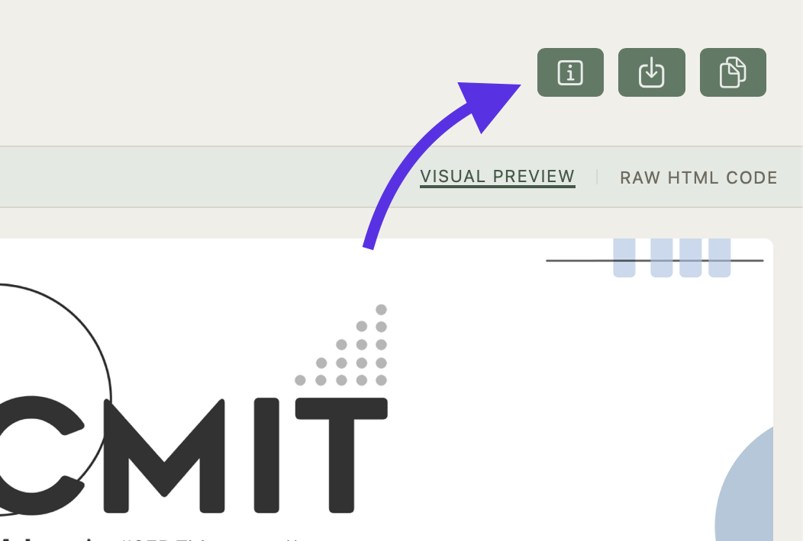

<div align='center'>
<h1>Quill</h1>
<p>CMIT's proprietary mail drafting application</p>

<p>Maintained by <a href="https://AKwasTaken.github.io" target="_blank" rel="noopener noreferrer">AK</a>.</p>

<br><br>
</div>

**[Quill](https://cmit.iisertvm.ac.in/quill)** is a lightweight, web-based email compiler designed for CMIT to streamline the creation of clean, email-compliant HTML newsletters and mailers.

---

## Features

- **Custom Email DSL**: Write pre-designed HTML using human-readable text blocks instead of raw HTML.
- **Syntax Highlighting**: Powered by CodeMirror for real-time syntax highlighting of blocks, directives, and properties.
- **Instant Dual Preview**: Real-time visual rendering on one side.
- **Dark Mode Simulator**: Test how your email layout holds up against mobile iOS/Gmail Dark Mode color inversions with a toggle.
- **One-Click Actions**: Copy the rendered HTML layout, and/or copy the raw code string, or download the `.html` file directly.
- **Zero Dependencies**: Client-side compilation running directly in the browser.

---

## Working

Srijana parses input text blocks and compiles them into inline-styled, table-based HTML wrappers guaranteed to render reliably across desktop and mobile email clients (including Gmail and Outlook).

### General Syntax Rules

1. **Global Directives**: Declared at the top of the file (e.g., `.title: Event Name`).
2. **Block Structure**: Written as `blocktype { ... }` or `blocktype {}` for empty elements.
3. **Property Modifiers**: Attached directly beneath a block’s closing brace using `.property: value` syntax.
4. **Comments**: Any line starting with `//` outside a block is ignored.

---

## Syntax Guide

Refer to the in-page documentation for more information.



---

## Project Structure

```text
Quill
.
├── LICENSE
├── README.md
├── css
│   ├── cmit-quill.css
│   ├── general.css
│   └── preloader.css
├── icons
│   ├── copy.svg
│   ├── download.svg
│   ├── info.svg
│   └── light_mode.svg
├── index.html
├── js
│   ├── cmit-dsl-mode.js
│   ├── mail-compiler.js
│   └── quill-loader.js
└── template.html
```

---

## Quick Start

Open the site hosted here on [Github Pages](https://cmit.iisertvm.ac.in/quill), to use it live.

### For local hosting, follow the instructions below:

1. Clone the repository:

```bash
git clone https://github.com/cmitiiser/quill.git
```

2. CD into the projects folder

```bash
cd Quill/
```

3. Open `index.html` in any modern web browser to use the tool.

---
